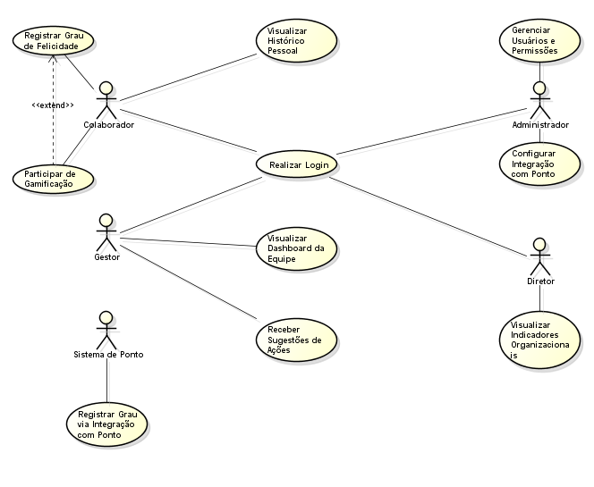

🏗️ Diagrama de Classes
## 1. Introdução
O diagrama de classes é um dos principais elementos da modelagem estática
de sistemas orientados a objetos. Ele representa de forma visual as estruturas do
sistema, como classes, atributos, métodos e os relacionamentos entre elas.
Sua importância está em permitir uma visão organizada e clara de como os
componentes do sistema interagem, ajudando tanto na fase de análise e design
quanto na implementação.
No caso do sistema Termômetro da Felicidade, o diagrama foi utilizado para
estruturar os principais elementos que compõem o gerenciamento de usuários,
registros de felicidade, gamificação e monitoramento de indicadores de bem-estar
dentro da organização.

## 2. Classes Identificadas
As principais classes identificadas no sistema são:
• Usuário – Classe base que representa qualquer pessoa cadastrada no
sistema.
• Colaborador – Herda de Usuário; pode responder questionários, enviar
sugestões e participar da gamificação.
• Gestor – Herda de Usuário; visualiza o desempenho da equipe e recebe
sugestões.
• Diretor – Herda de Usuário; visualiza o desempenho geral da empresa.
• Administrador – Herda de Usuário; gerencia usuários e configura
integrações do sistema.
• Conta – Representa o cadastro de cada usuário, com status e métodos de
controle.
• QuestionárioFelicidade – Contém as perguntas e respostas de satisfação
dos colaboradores.
• RegistroFelicidade – Armazena os níveis de felicidade registrados pelos
usuários.
• Sugestão – Guarda as ideias e sugestões enviadas pelos colaboradores.
• Gamificação – Controla pontuação e ranking dos participantes.
• Dashboard – Exibe relatórios e médias de felicidade.
• SistemaPonto – Registra horários de entrada e saída dos colaboradores.
• Autenticador – Responsável por validar credenciais e gerar sessões de
login.

## 3. Relacionamentos
• Herança (Generalização):
A classe Usuário é a classe pai de Colaborador, Gestor, Diretor e
Administrador, permitindo o reaproveitamento de atributos e métodos
comuns.
• Associação:
o Um Colaborador está associado a vários Questionários de
Felicidade e várias Sugestões.
o Um Questionário de Felicidade está ligado a vários Registros de
Felicidade.
o Um Gestor e um Diretor estão associados a um Dashboard.
o O Administrador gerencia várias Contas e se relaciona com o
Sistema de Ponto.
o O Autenticador se conecta à classe Usuário para realizar a
autenticação.
Esses relacionamentos permitem o fluxo de informações entre as partes do
sistema e representam como cada elemento coopera para o funcionamento do
Termômetro da Felicidade.

## 4. Diagrama UML
