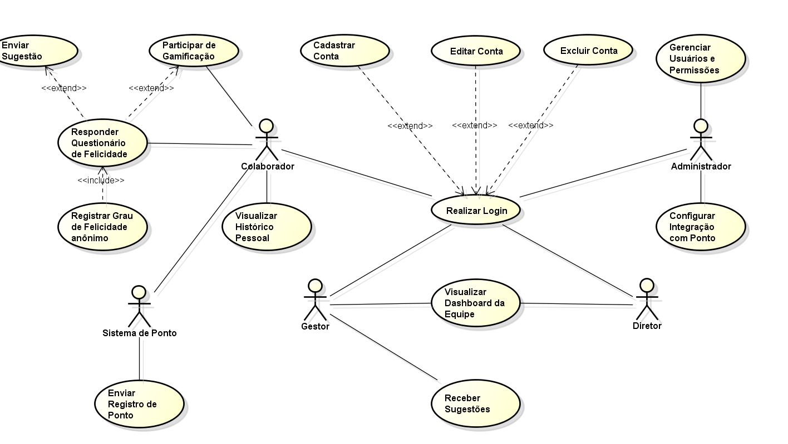
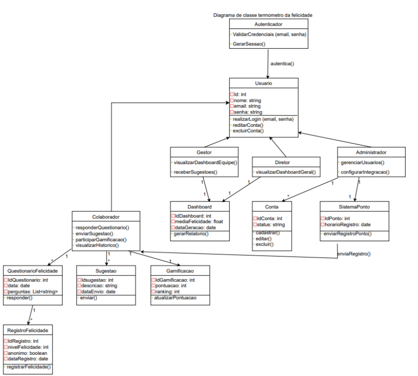
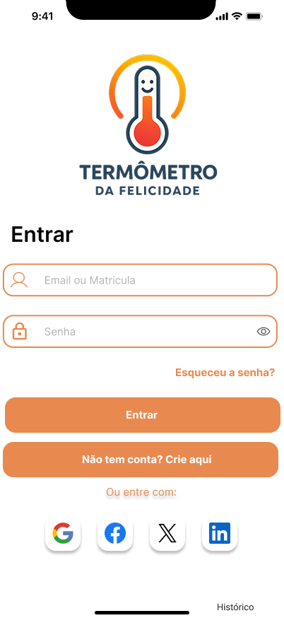
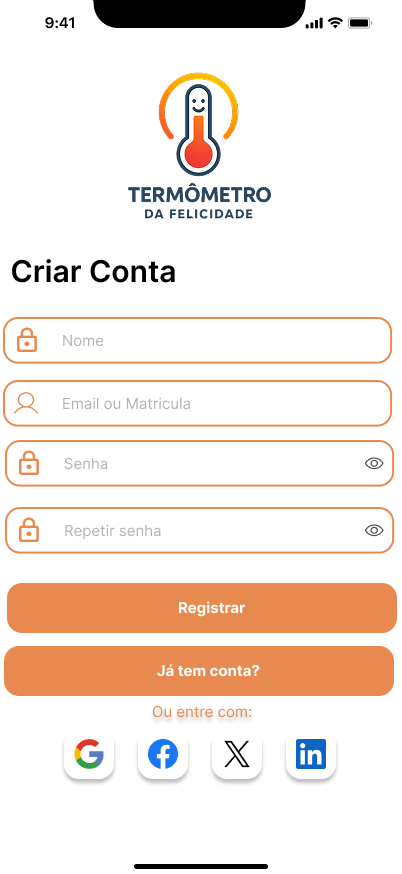
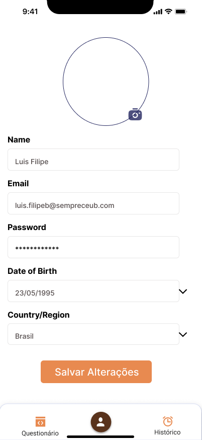
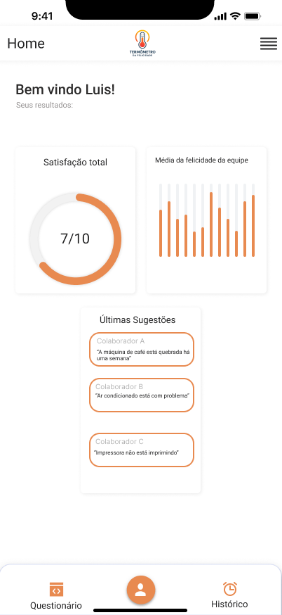
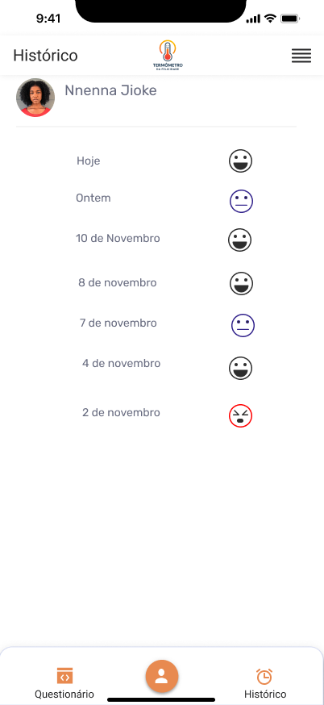
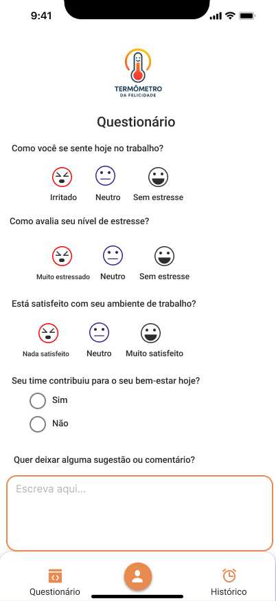
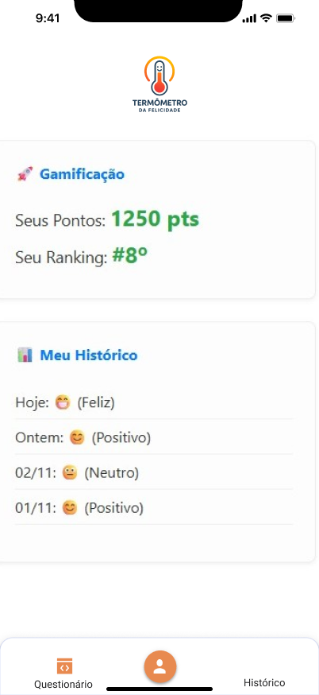
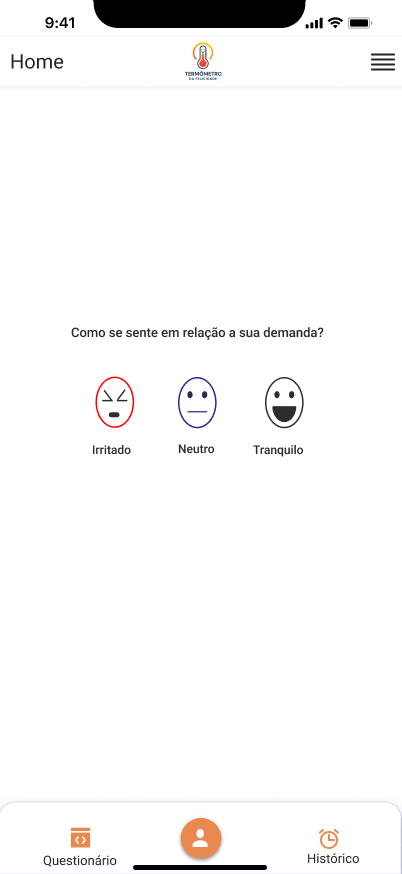

# 📘 Projeto de Sistema Computacional - "Termômetro da Felicidade"

Curso: Superior de Tecnologia em Análise e Desenvolvimento de Sistemas

Disciplina: Análise e Projeto de Sistemas

Orientador: Prof. Me. Denys Alves da Silva

Alunos:  
         22451415 Luis Filipe Campelo Aragão Belinho luis.filipeb@sempreceub.com  
         22454566 Vinicius Mendes de Godoi vinicius.godoi@sempreceub.com  
         22450356 Jonatan Rodrigues Silva Corrêa jhonatan.correa@sempreceub.com  
         22452326 Cauã Gonçalves Xavier Mrad caua.xavier@sempreceub.com  
         22450242 João Victor Alves Rodrigues joao.arodrigues@sempreceub.com  
         22404801 Maria Eduarda de Sousa Sales edurdasales@sempreceub.com 
         
      
---

## 📑 Sumário
1. [Documento de Visão do Sistema](#1-documento-de-visão-do-sistema)  
2. [Diagrama de Caso de Uso](#2-diagrama-de-caso-de-uso)  
3. [Especificação de Caso de Uso](#3-especificação-de-caso-de-uso)  
4. [Diagrama de Classe](#4-diagrama-de-classe)  
5. [Documento de Arquitetura do Sistema](#5-documento-de-arquitetura-do-sistema)  
6. [Protótipo do Sistema](#6-protótipo-do-sistema)  

---

# 1. Documento de Visão do Sistema - Termômetro da Felicidade

## 1.1 Introdução  
O sistema **Termômetro da Felicidade** tem como propósito apoiar organizações na **avaliação e acompanhamento do bem-estar e felicidade dos colaboradores**. Ele será uma ferramenta computacional de apoio à decisão, permitindo que gestores tenham indicadores claros e confiáveis sobre aspectos emocionais, sociais e profissionais dos funcionários, indo além de métricas tradicionais como produtividade e absenteísmo.  

---

## 1.2 Objetivos
Desenvolver um sistema de informação para avaliar o nível de felicidade no local de trabalho, facilitando decisões gerenciais sobre o bem-estar dos colaboradores.  

## 1.3 Benefícios Esperados

### Para a Gestão e Organização:
- Fornecer visibilidade em tempo real sobre o clima organizacional e variações de humor, permitindo **ações imediatas**.  
- Aumentar o **engajamento, a produtividade e a retenção de talentos**.  
- Subsidiar decisões gerenciais com **dados objetivos e contínuos**.  
- Reduzir custos associados ao **absenteísmo** e à **rotatividade de funcionários (turnover)**.  
- Aprimorar a cultura organizacional, fomentando um ambiente de **confiança e feedback contínuo**.  

### Para a Comunidade Acadêmica e Social:
- Contribuir com o avanço das áreas de **Sistemas de Informação** e **Engenharia de Software**.  
- Disponibilizar o sistema, a documentação e o código-fonte de forma **gratuita**, para que outras organizações possam adotá-lo e adaptá-lo.  

---

## 1.4 Público-Alvo
O público-alvo são **organizações**, com foco principal nas de **pequeno e médio porte**, que atualmente não dispõem de ferramentas adequadas para monitorar de forma sistemática e contínua o bem-estar e a felicidade de seus colaboradores.  

O sistema também se destina a **qualquer organização interessada** em adotar uma ferramenta gratuita para essa finalidade.  

--- 

## 1.5 Stakeholders  
- **Colaboradores**: respondem pesquisas e interagem com o sistema para medir bem-estar.  
- **Gestores e líderes**: utilizam relatórios e indicadores para tomada de decisão.  
- **Equipe de RH**: aplica ações de engajamento, treinamentos e acompanhamento.  
- **Administradores do sistema**: responsáveis pela configuração, manutenção e segurança da plataforma.  

## 1.6 Escopo

**O que está no escopo:**
- Coletar o grau de felicidade dos colaboradores de forma integrada ao momento do registro de ponto.  
- Apresentar aos gestores os resultados em tempo real por meio de um **dashboard**.  
- Disponibilizar o sistema para plataformas **Web e Mobile**.  
- Sugerir ações aos gestores com base nos dados coletados e na inteligência computacional.  
- Manter um histórico dos níveis de felicidade e das ações gerenciais realizadas.  

**O que não está no escopo:**
- O sistema não é uma ferramenta de registro de ponto, mas sim **integrado a ele**.  
- Não se trata de uma plataforma para terapia ou apoio psicológico direto, mas sim uma ferramenta de **monitoramento para gestão**.  
- O sistema não substituirá outros processos de Recursos Humanos, como **avaliação de desempenho ou controle de frequência**.  

## 1.7 Restrições  
- **Técnicas**: necessidade de integração segura com banco de dados; sistema deve ser responsivo (desktop e mobile).  
- **Orçamento**: foco em soluções acessíveis para pequenas e médias empresas, evitando altos custos de licenciamento.  
- **Prazos**: dependentes do cronograma de pesquisa e desenvolvimento.  
- **Requisitos obrigatórios**: confidencialidade dos dados, conformidade com a **LGPD**.  

## 1.8 Critérios de Sucesso  
- Pelo menos **70% dos colaboradores** participando das medições periódicas.  
- Adoção do sistema por pelo menos **X organizações piloto** em até 6 meses.  
- **Redução de absenteísmo ou turnover** nas organizações que utilizarem o sistema.  
- Feedback positivo de gestores quanto à usabilidade e utilidade dos relatórios.  
- Disponibilização pública do sistema e da documentação como contribuição científica e social.  

## 2. Diagrama de Caso de Uso

## 2.1 Introdução

O Diagrama de Casos de Uso representa as principais funcionalidades do sistema Termômetro da Felicidade e as interações entre os diferentes atores (usuários e sistemas externos).
Essa visão facilita a compreensão das responsabilidades de cada papel e apoia a priorização dos requisitos funcionais do projeto.

O modelo destaca as operações de login, coleta e acompanhamento de felicidade, gamificação, sugestões, dashboards e integrações administrativas.
Ele também serve como base para os demais artefatos UML, garantindo rastreabilidade entre requisitos e design.

## 2.2 Atores Identificados

Colaborador — Registra e acompanha seu grau de felicidade, participa de gamificação e pode enviar sugestões. 
Gestor — Acompanha os indicadores de felicidade da equipe e recebe sugestões enviadas pelos colaboradores. 
Diretor — Visualiza o dashboard geral da equipe para análise organizacional. 
Administrador — Gerencia usuários, permissões e configurações de integração com o sistema de ponto. 
Sistema de Ponto (externo) — Sistema de registro de ponto da organização que poderá enviar uma mensagem como link para o colaborador motivando o colaborador a informar seu grau de felicidade no momento, possibilitando o vínculo automático com a coleta de felicidade. 

## 2.3 Casos de Uso Identificados
2.3.1 Realizar Login — Todos os Usuários
2.3.2 Cadastrar, Editar e Excluir Conta — Administrador / Colaborador
2.3.3 Responder Questionário de Felicidade — Colaborador
2.3.4 Registrar Grau de Felicidade Anônimo — Colaborador
2.3.5 Participar de Gamificação — Colaborador
2.3.6 Enviar Sugestão — Colaborador
2.3.7 Visualizar Histórico Pessoal — Colaborador
2.3.8 Visualizar Dashboard da Equipe — Gestor / Diretor
2.3.9 Receber Sugestões — Gestor
2.3.10 Gerenciar Usuários e Permissões — Administrador
2.3.11 Configurar Integração com Ponto — Administrador
2.3.12 Enviar Registro de Ponto — Sistema de Ponto (Externo) / Colaborador

## 2.4 Diagrama UML

---

## 3. Especificação de Caso de Uso

# 📝 Especificação de Casos de Uso – Termômetro da Felicidade

## 3.1 Realizar Login
| Item                 | Descrição |
|----------------------|-----------|
| **Nome**             | Realizar Login |
| **Ator Principal**   | Usuário (Colaborador, Gestor, Diretor, Administrador) |
| **Pré-condições**    | Usuário já cadastrado no sistema |
| **Fluxo Principal**  | 1. Usuário insere login e senha   2. Sistema valida credenciais   3. Sistema libera acesso |
| **Fluxos Alternativos** | Senha incorreta → Sistema exibe mensagem de erro |
| **Pós-condições**    | Usuário autenticado no sistema |
| **Regras de negócio**| Senha deve ter no mínimo 8 caracteres |

---

## 3.2.1 Cadastrar Conta
| Item               | Descrição |
|--------------------|-----------|
| **Nome**           | Cadastrar Conta |
| **Ator Principal** | Colaborador / Administrador |
| **Pré-condições**  | Usuário autenticado com permissões adequadas |
| **Fluxo Principal**| 1. Usuário acessa tela de cadastro   2. Preenche dados obrigatórios   3. Sistema valida e cria a conta |
| **Fluxos Alternativos** | Dados inválidos → Sistema solicita correção |
| **Pós-condições**  | Conta criada com sucesso |

---

## 3.2.2 Editar Conta
| Item               | Descrição |
|--------------------|-----------|
| **Nome**           | Editar Conta |
| **Ator Principal** | Colaborador / Administrador |
| **Pré-condições**  | Usuário autenticado |
| **Fluxo Principal**| 1. Usuário acessa sua conta   2. Altera dados desejados   3. Sistema valida e confirma alterações |
| **Fluxos Alternativos** | Dados inválidos → Sistema solicita correção |
| **Pós-condições**  | Dados atualizados com sucesso |

---

## 3.2.3 Excluir Conta
| Item               | Descrição |
|--------------------|-----------|
| **Nome**           | Excluir Conta |
| **Ator Principal** | Administrador |
| **Pré-condições**  | Administrador autenticado |
| **Fluxo Principal**| 1. Administrador seleciona conta   2. Sistema exibe confirmação   3. Conta é removida do sistema |
| **Fluxos Alternativos** | Se usuário tentar excluir sua própria conta → Sistema bloqueia ação |
| **Pós-condições**  | Conta removida do sistema |

---

## 3.3 Responder Questionário de Felicidade
| Item               | Descrição |
|--------------------|-----------|
| **Nome**           | Responder Questionário de Felicidade |
| **Ator Principal** | Colaborador |
| **Pré-condições**  | Colaborador autenticado no sistema |
| **Fluxo Principal**| 1. Sistema exibe questionário   2. Colaborador responde   3. Sistema registra no histórico |
| **Fluxos Alternativos** | Conexão perdida → Sistema salva parcialmente e retoma |
| **Pós-condições**  | Registro salvo no histórico pessoal |
| **Relações**       | `<<include>> Registrar Grau de Felicidade Anônimo`   `<<extend>> Participar de Gamificação / Enviar Sugestão` |

---

## 3.4 Registrar Grau de Felicidade Anônimo
| Item               | Descrição |
|--------------------|-----------|
| **Nome**           | Registrar Grau de Felicidade Anônimo |
| **Ator Principal** | Colaborador |
| **Pré-condições**  | Acesso ao questionário ativo |
| **Fluxo Principal**| 1. Colaborador responde questionário   2. Sistema salva resposta sem vínculo com identidade |
| **Pós-condições**  | Registro anônimo armazenado |
| **Relações**       | `<<include>> do Questionário de Felicidade` |

---

## 3.5 Participar de Gamificação
| Item               | Descrição |
|--------------------|-----------|
| **Nome**           | Participar de Gamificação |
| **Ator Principal** | Colaborador |
| **Pré-condições**  | Respostas válidas no questionário |
| **Fluxo Principal**| 1. Colaborador participa respondendo   2. Sistema gera pontos e atualiza ranking |
| **Pós-condições**  | Colaborador pontua na gamificação |
| **Relações**       | `<<extend>> do Questionário de Felicidade` |

---

## 3.6 Enviar Sugestão
| Item               | Descrição |
|--------------------|-----------|
| **Nome**           | Enviar Sugestão |
| **Ator Principal** | Colaborador |
| **Pré-condições**  | Colaborador autenticado |
| **Fluxo Principal**| 1. Colaborador escreve sugestão   2. Sistema registra e envia ao Gestor |
| **Pós-condições**  | Sugestão disponível para gestores |
| **Relações**       | `<<extend>> do Questionário de Felicidade` |

---

## 3.7 Visualizar Histórico Pessoal
| Item               | Descrição |
|--------------------|-----------|
| **Nome**           | Visualizar Histórico Pessoal |
| **Ator Principal** | Colaborador |
| **Pré-condições**  | Colaborador autenticado |
| **Fluxo Principal**| 1. Colaborador acessa histórico   2. Sistema exibe registros passados |
| **Pós-condições**  | Histórico exibido para análise individual |

---

## 3.8 Visualizar Dashboard da Equipe
| Item               | Descrição |
|--------------------|-----------|
| **Nome**           | Visualizar Dashboard da Equipe |
| **Ator Principal** | Gestor / Diretor |
| **Pré-condições**  | Usuário autenticado |
| **Fluxo Principal**| 1. Usuário acessa dashboard   2. Sistema processa e apresenta gráficos |
| **Pós-condições**  | Indicadores exibidos para tomada de decisão |

---

## 3.9 Receber Sugestões
| Item               | Descrição |
|--------------------|-----------|
| **Nome**           | Receber Sugestões |
| **Ator Principal** | Gestor |
| **Pré-condições**  | Sugestões enviadas por colaboradores |
| **Fluxo Principal**| 1. Sistema lista sugestões   2. Gestor visualiza e avalia |
| **Pós-condições**  | Sugestões ficam disponíveis para análise |

---

## 3.10 Gerenciar Usuários e Permissões
| Item               | Descrição |
|--------------------|-----------|
| **Nome**           | Gerenciar Usuários e Permissões |
| **Ator Principal** | Administrador |
| **Pré-condições**  | Administrador autenticado |
| **Fluxo Principal**| 1. Administrador acessa painel de usuários   2. Adiciona, altera ou remove permissões |
| **Pós-condições**  | Usuários e papéis atualizados |

---

## 3.11 Configurar Integração com Ponto
| Item               | Descrição |
|--------------------|-----------|
| **Nome**           | Configurar Integração com Ponto |
| **Ator Principal** | Administrador |
| **Pré-condições**  | Administrador autenticado |
| **Fluxo Principal**| 1. Admin insere parâmetros técnicos   2. Sistema valida   3. Configuração salva |
| **Pós-condições**  | Integração habilitada |

---

## 3.12 Enviar Registro de Ponto
| Item               | Descrição |
|--------------------|-----------|
| **Nome**           | Enviar Registro de Ponto |
| **Ator Principal** | Sistema de Ponto (Externo) |
| **Pré-condições**  | Sistema de ponto ativo |
| **Fluxo Principal**| 1. Colaborador registra entrada   2. Sistema de ponto envia dados ao Termômetro   3. Sistema solicita grau de felicidade |
| **Pós-condições**  | Registro de ponto vinculado ao questionário de felicidade |

---
## 4. Diagrama de Classes

## 4.1. Introdução
O diagrama de classes é um dos principais elementos da modelagem estática de sistemas orientados a objetos. Ele representa de forma visual as estruturas do sistema, como classes, atributos, métodos e os relacionamentos entre elas. Sua importância está em permitir uma visão organizada e clara de como os componentes do sistema interagem, ajudando tanto na fase de análise e design quanto na implementação.

No caso do sistema Termômetro da Felicidade, o diagrama foi utilizado para estruturar os principais elementos que compõem o gerenciamento de usuários, registros de felicidade, gamificação e monitoramento de indicadores de bem-estar dentro da organização.

## 4.2. Classes Identificadas
As principais classes identificadas no sistema são: • Usuário – Classe base que representa qualquer pessoa cadastrada no sistema.

• Colaborador – Herda de Usuário; pode responder questionários, enviar sugestões e participar da gamificação.

• Gestor – Herda de Usuário; visualiza o desempenho da equipe e recebe sugestões.

• Diretor – Herda de Usuário; visualiza o desempenho geral da empresa.

• Administrador – Herda de Usuário; gerencia usuários e configura integrações do sistema.

• Conta – Representa o cadastro de cada usuário, com status e métodos de controle.

• QuestionárioFelicidade – Contém as perguntas e respostas de satisfação dos colaboradores.

• RegistroFelicidade – Armazena os níveis de felicidade registrados pelos usuários.

• Sugestão – Guarda as ideias e sugestões enviadas pelos colaboradores.

• Gamificação – Controla pontuação e ranking dos participantes.

• Dashboard – Exibe relatórios e médias de felicidade.

• SistemaPonto – Registra horários de entrada e saída dos colaboradores.

• Autenticador – Responsável por validar credenciais e gerar sessões de login.

## 4.3. Relacionamentos
• Herança (Generalização): A classe Usuário é a classe pai de Colaborador, Gestor, Diretor e Administrador, permitindo o reaproveitamento de atributos e métodos comuns.

• Associação: o Um Colaborador está associado a vários Questionários de Felicidade e várias Sugestões. o Um Questionário de Felicidade está ligado a vários Registros de Felicidade.

o Um Gestor e um Diretor estão associados a um Dashboard.

o O Administrador gerencia várias Contas e se relaciona com o Sistema de Ponto.

o O Autenticador se conecta à classe Usuário para realizar a autenticação.

Esses relacionamentos permitem o fluxo de informações entre as partes do sistema e representam como cada elemento coopera para o funcionamento do Termômetro da Felicidade.

## 4.4. Diagrama UML

## 5. Arquitetura do sistema

## 5.1 Visão Geral

O sistema Termômetro da Felicidade adota uma arquitetura em camadas, composta por camada de apresentação, camada de lógica de negócios e camada de persistência. Essa divisão promove maior organização, segurança e facilidade de manutenção. O modelo segue o padrão MVC (Model-View-Controller), onde a interface do usuário se comunica com os controladores, que por sua vez acessam os modelos e o banco de dados.

## 5.2. Tecnologias Utilizadas

- Linguagem de programação: Python (para backend) e JavaScript (para frontend)
- Frameworks: Django ou Flask no backend; React ou Next.js no frontend
- Banco de dados: PostgreSQL
- Bibliotecas: Pandas, SQLAlchemy, Axios, Chart.js, TailwindCSS
- Controle de versão: GitHub
- Ambiente de hospedagem: Render, Vercel ou AWS
  
## 5.3. Integrações

O sistema poderá integrar-se com APIs externas, como serviços de autenticação (Google Auth), plataformas de RH, e ferramentas analíticas. As integrações visam enriquecer a coleta e análise de dados, mantendo a interoperabilidade e segurança das informações.

## 5.4. Segurança

A segurança será garantida através de autenticação por token JWT, criptografia de dados sensíveis e uso de HTTPS. Cada perfil de usuário (colaborador, gestor, diretor e administrador) terá permissões específicas definidas em um sistema de controle de acesso baseado em papéis (RBAC).

## 5.5. Requisitos Não Funcionais
- Desempenho: o sistema deve responder a requisições em até 3 segundos.
- Disponibilidade: uptime mínimo de 99%.
- Escalabilidade: suporte a crescimento horizontal por meio de contêineres Docker.
- Segurança: conformidade com a LGPD.
- Usabilidade: interface intuitiva e responsiva para desktop e dispositivos móveis.
  
## 5.6. Diagrama Arquitetural
O diagrama abaixo representa a interação entre as camadas do sistema e os principais componentes (Frontend, Backend, Banco de Dados e APIs externas).

# 6. Protótipo do Sistema

## 6.1. Introdução

O protótipo tem como objetivo representar visualmente o fluxo e a interface do usuário do sistema antes do desenvolvimento final.
Ele permite validar a navegação, testar a usabilidade e identificar ajustes necessários no layout e na experiência do usuário.
Com o protótipo, é possível avaliar se as telas atendem às necessidades do projeto e do público-alvo.

## 6.2. Ferramentas Utilizadas

O protótipo foi desenvolvido utilizando a ferramenta Figma, que possibilita criar telas interativas, fluxos completos e componentes reutilizáveis.
Outras ferramentas alternativas que poderiam ser usadas incluem Balsamiq, Draw.io e PowerPoint, mas o Figma foi escolhido por oferecer melhor controle visual e recursos modernos de prototipagem.

## 6.3. Telas do Sistema

As seguintes telas foram prototipadas:

Tela de Login
Entrada do usuário com campos de email e senha.

Tela de Cadastro
Formulário para criação de nova conta (nome, email, senha).

Dashboard
Visão geral do sistema, incluindo ações rápidas e resumo de atividades.

Tela de Histórico
Lista de transações organizadas por data, com status (Paid, Issued, Overdue).

Tela de Detalhes da Transação
Mostra informações completas sobre uma transação selecionada.

Tela de Nova Fatura (New Invoice)
Formulário para criar nova fatura com itens, valores e cliente.

Tela de Confirmação
Mensagem de sucesso após criação da fatura, com opções de visualizar ou voltar ao dashboard.

## 6.4. Protótipo
### Telas universais

### Telas do gestor

### Telas do colaborador

